# FinFlow User Guide

This guide explains how to navigate FinFlow and what each major feature does. It also describes the results you should expect after you use each feature.

---

## 1. Sign in and first-time setup

### 1.1 Sign in

1. Open FinFlow in your browser.
2. Sign in (currently implemented via Google OAuth in the backend).

<!-- Screenshot: login page -->
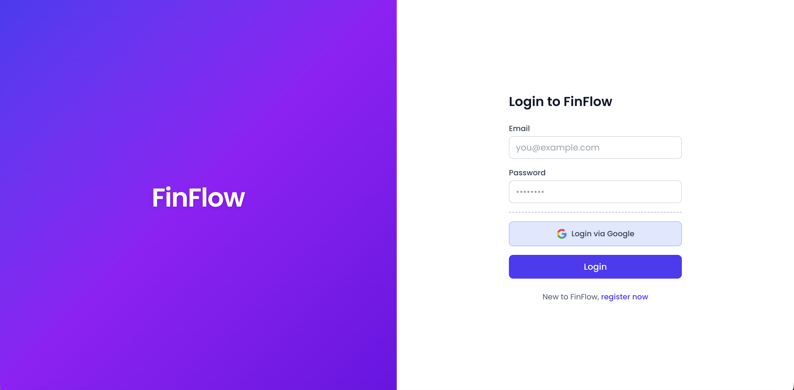

### 1.2 Complete your profile (first time only)

After a successful Google login, if this is your first time, FinFlow will ask you to complete additional profile details.

Fill in:

- Date of birth
- Time zone
- Base currency (this is the currency used for dashboard totals in the MVP)

<!-- Screenshot: Google OAuth onboarding -->
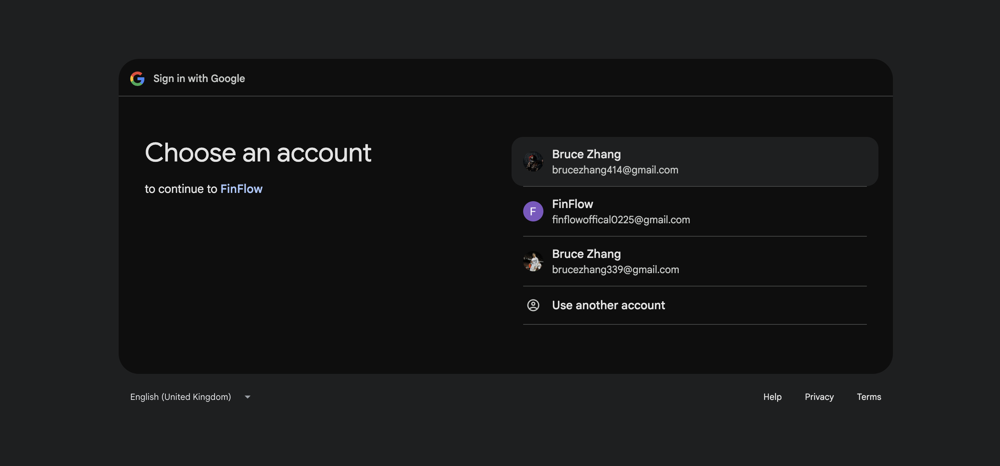

Result:

- Your user profile is created.
- FinFlow automatically creates the default system categories for you (so categorization and spending-by-category can work immediately).
- You are redirected to the dashboard.

---

## 2. Navigation overview

Use the main app pages to move between the core workflows:

- `Dashboard`: your high-level money snapshot and quick insights
- `Accounts`: create/rename/archive accounts and see balances
- `Transactions`: view and add transactions (manual entry in this MVP)
- `Categories`: view system categories used for labeling spending
- `Budgets`: create and manage category budgets

---

## 3. Dashboard

The dashboard summarizes your activity based on your data and your selected base currency.

<!-- Screenshot: dashboard overview -->
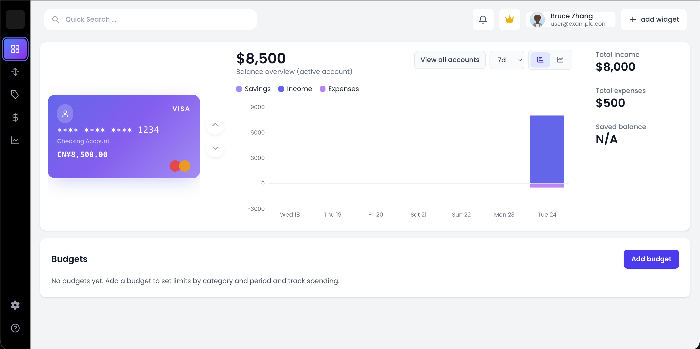

### 3.1 KPI tiles and totals

You will typically see the following:

- **Total Balance**: total balance across active accounts, shown in your **base currency** only
- **Month-to-date Spending**: total expense transactions for the current month (OUT transactions), shown in base currency
- **Month-to-date Income**: total income transactions for the current month (IN transactions), shown in base currency

Important MVP behavior:

- The dashboard skips accounts/transactions whose currency does not match your base currency.

### 3.2 Spending by category

You will see your spending grouped by category for the current month:

- Transactions classified with a category are aggregated under that category name
- Transactions with no assigned category appear under **Uncategorized**

Result:

- As you add transactions and categories are assigned, this section updates automatically.

### 3.3 Accounts preview

The dashboard shows active accounts (a quick list preview).

Result:

- Archived/deactivated accounts do not appear here.

<!-- Screenshot: dashboard onboarding -->
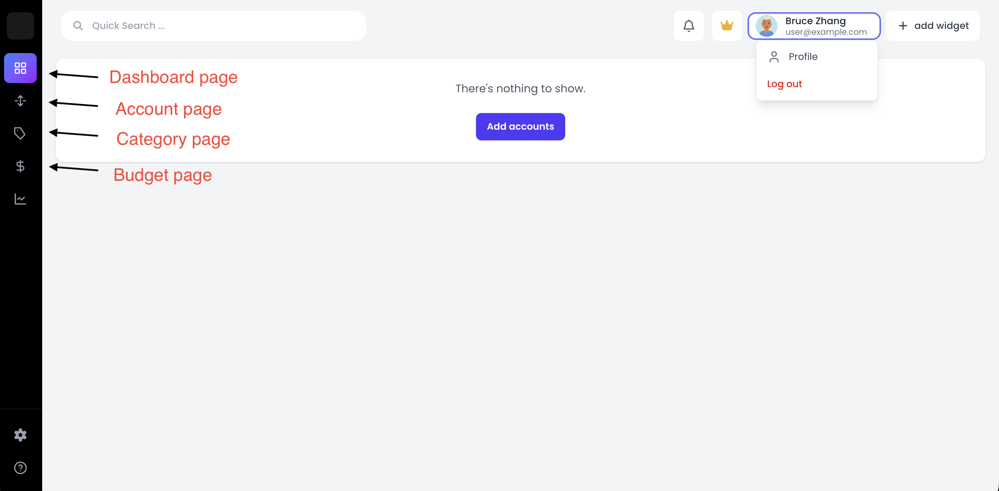

### 3.4 Recent transactions

The dashboard also shows a short feed of your most recent posted transactions across active accounts (sorted by posted date, newest first).

Each item typically includes:

- amount (with currency)
- posted date
- counterparty name
- category (when available)

---

## 4. Accounts (Manage accounts)

Use Accounts to set up which financial accounts you want FinFlow to track.

### 4.1 Create an account

When you add an account, FinFlow stores:

- account type and origin
- provider account name and institution details
- optional nickname/display name
- last 4 digits of account number (if provided)
- initial/current balance (amount + currency)

<!-- Screenshot: create account form -->
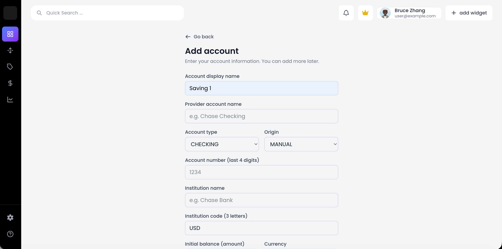

Result:

- Once active, the account appears on the dashboard totals (if its currency matches your base currency in the MVP).

### 4.2 Rename an account

You can change an account’s display name/nickname.

Result:

- The dashboard account preview and other account lists reflect the new display name.

### 4.3 Archive / deactivate an account

Deleting an account in this app deactivates it (archives it for reference).

Result:

- Deactivated accounts are excluded from dashboard totals and active account lists.
- You can still view archived accounts from the Accounts page (if the UI provides an archived tab/section).

<!-- Screenshots: account state changes -->
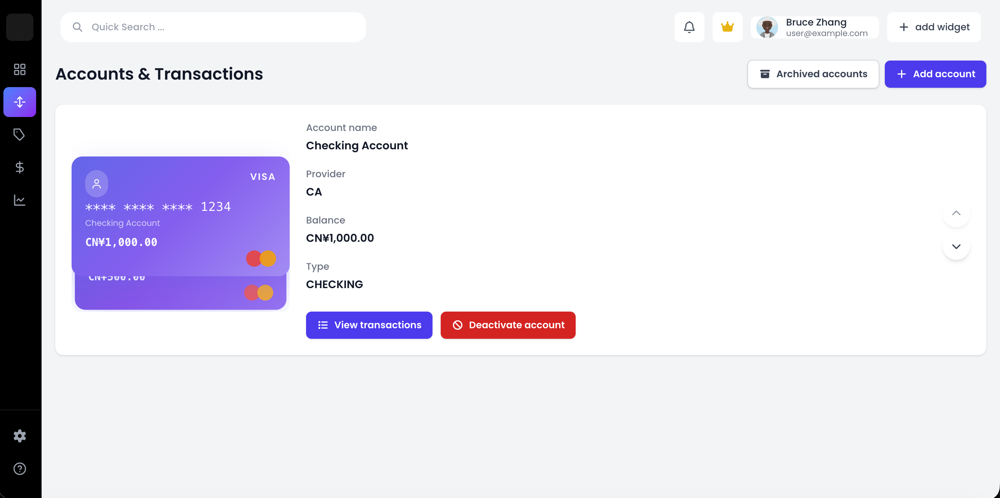
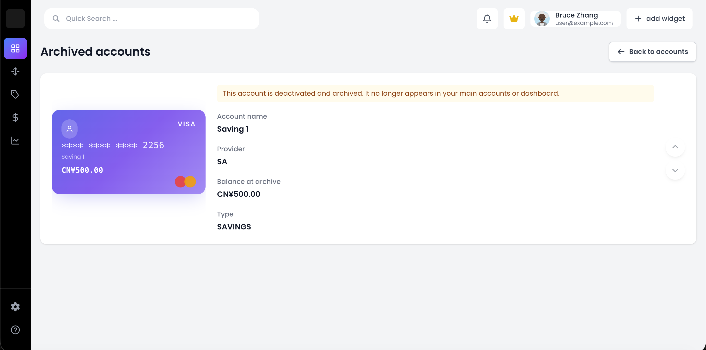
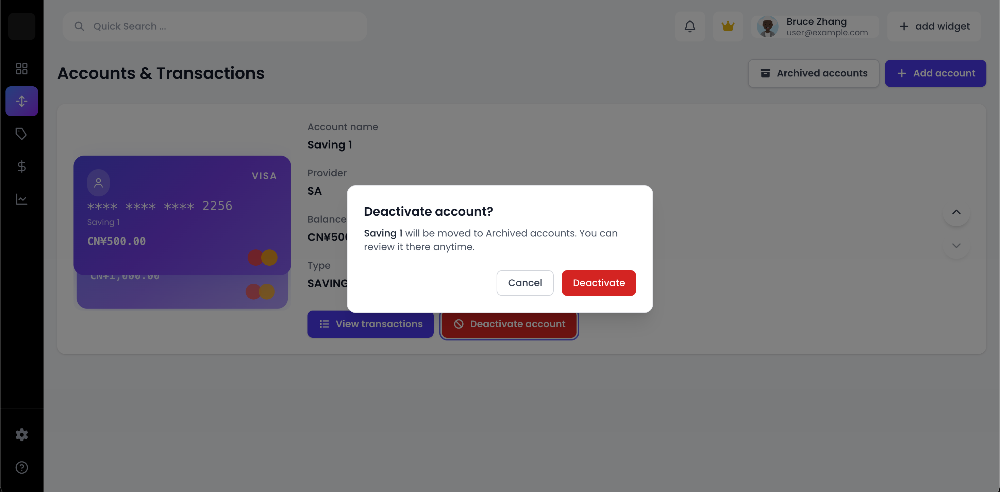

---

## 5. Transactions

Transactions let you review activity per account and add new entries.

### 5.1 View transactions (per account)

Open Transactions and select an account. The list is ordered with the most recently posted transactions at the top.

Each transaction item typically includes:

- amount (with currency)
- posted date
- counterparty name
- category (or uncategorized)

<!-- Screenshot: transactions list -->
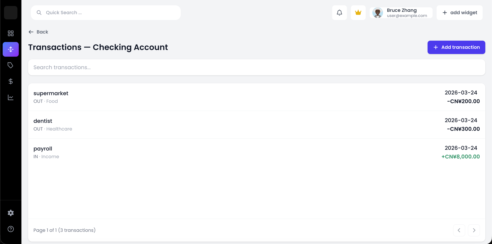

### 5.2 Transaction details

When you open a transaction, you should be able to see its metadata, such as:

- transaction direction (IN/OUT)
- transaction type (CREDIT/DEBIT/TRANSFER)
- transaction origin (in this MVP: manual entries)
- posted date and reference (when provided)
- counterparty type (PERSON/MERCHANT/BANK/Government/UNKNOWN)
- category (category id reference if the UI shows it, otherwise the category name)

Result:

- This helps you understand why a transaction ended up in a specific category.

### 5.3 Add a manual transaction

In this MVP, users can add transactions manually.

Typical fields:

- Amount (and currency)
- Posted date
- Transaction type:
  - `CREDIT` (money coming in, treated as IN)
  - `DEBIT` (money going out, treated as OUT)
  - `TRANSFER` (modeled in the backend; confirm UI support in your frontend)
- Counterparty name
- Counterparty type (PERSON/MERCHANT/BANK/Government/UNKNOWN)
- Reference (optional)

<!-- Screenshot: create transaction form -->
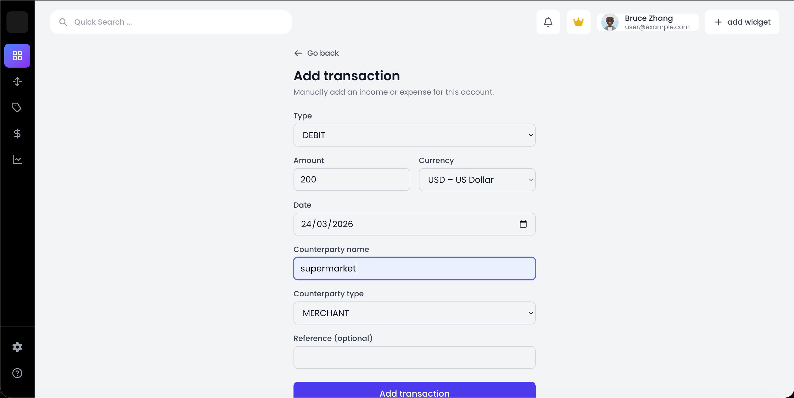

Result:

- FinFlow attempts to auto-assign a category based on your counterparty information.
- The dashboard “Spending by category” and “Recent transactions” update once the transaction is saved (depending on the posted date and base currency).

### 5.4 Categorization (how the category gets chosen)

When you save a manual transaction, FinFlow uses an ordered, deterministic rule set:

- Transfer transactions map to the `Transfer` category.
- Income-related keywords map to `Income`.
- Tax-related keywords map to `Taxes`.
- Utility keywords map to `Bills & Utilities`.
- Merchant/payee keywords map to specific expense categories like `Food`, `Travel`, `Shopping`, etc.
- If nothing matches, FinFlow falls back to `Miscellaneous`.

Important for user outcomes:

- Your category affects where the transaction appears in the dashboard spending breakdown.
- If you see a transaction in `Miscellaneous`, try updating the counterparty name/reference (or counterparty type) to trigger a better match.

---

## 6. Categories

Categories are used to label transactions and to group spending.

<!-- Screenshot: categories page -->
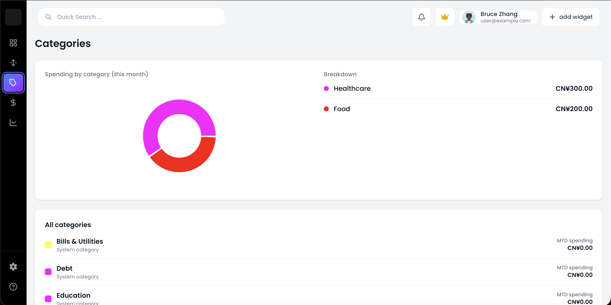

In this MVP:

- Categories are created automatically during onboarding.
- Category management (create/edit/delete) is not described in the backend controllers shown here; users primarily view categories.

System categories include:

- Food
- Income
- Transportation
- Housing
- Bills & Utilities
- Entertainment
- Healthcare
- Education
- Shopping
- Travel
- Debt
- Personal Care
- Savings & Investment
- Transfer
- Taxes
- Gifts & Donations
- Miscellaneous

Result:

- When you add transactions, FinFlow will assign one of these categories (or uncategorized if your UI chooses to hide category details).

---

## 7. Budgets

Budgets help you plan how much you want to spend in specific categories over time.

<!-- Screenshot: budgets page -->
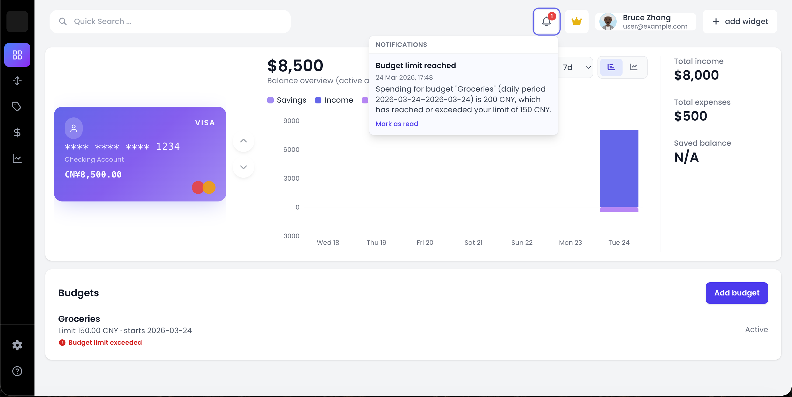

### 7.1 What a budget contains

Each budget stores:

- budget name
- period type and start date
- budget limit (amount + currency)
- category it applies to
- whether rollover is enabled
- whether the budget is active

Result:

- Your budgets page should show the saved budget configuration.
- If your frontend computes progress bars, the progress is typically derived from your category spending transactions.

### 7.2 Create and edit a budget

To create a budget:

- select the category
- set the limit
- configure period/start date and rollover

<!-- Screenshot: create budget form -->
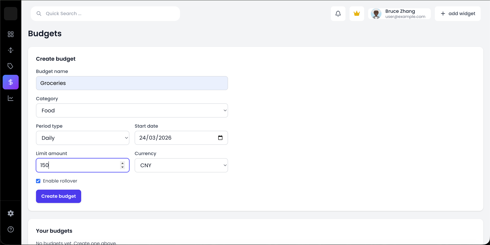

To edit a budget:

- update budget name and limit/details as needed
- toggle the budget active flag if your UI supports it

### 7.3 Delete a budget

You can remove a budget from your list.

Result:

- The deleted budget no longer appears in the Budgets page.

---

## 8. Currency behavior (MVP rules)

FinFlow uses your **base currency** as the primary currency for dashboard totals.

MVP behavior:

- Dashboard total balance, month-to-date spending, and month-to-date income include only accounts/transactions whose currency matches your base currency.
- Accounts and transactions in other currencies may not affect totals until multi-currency support is extended.

Result:

- If you add a transaction in a different currency, your dashboard totals might not change.

---

## 9. Common scenarios

### 9.1 “My grocery transaction shows up as Miscellaneous”

Likely causes:

- Counterparty name/reference did not match any built-in rule keywords.
- Counterparty type is set too broadly (e.g., `UNKNOWN`).

Try:

- Update the counterparty name/reference to the actual payee/merchant name.
- Set counterparty type to the closest option (for example, `MERCHANT`).

Result:

- After re-saving, the transaction should map to a more specific category like `Food`.

### 9.2 “My dashboard numbers didn’t change”

Common reasons:

- The transaction’s posted date is outside the current month.
- The transaction’s currency does not match your base currency (MVP behavior).
- You added the transaction to a deactivated/archived account (dashboard hides inactive accounts).

Result:

- Once you correct the posted date, currency, or account status, the dashboard should update.

---

## 10. Notes for future screenshots

If you add more UI features later (like alerts/data health, deeper budget progress visuals, or settings), add new sections here and follow the same pattern:

- explain the feature
- describe the results users see
- add screenshot placeholders for the key pages and forms

